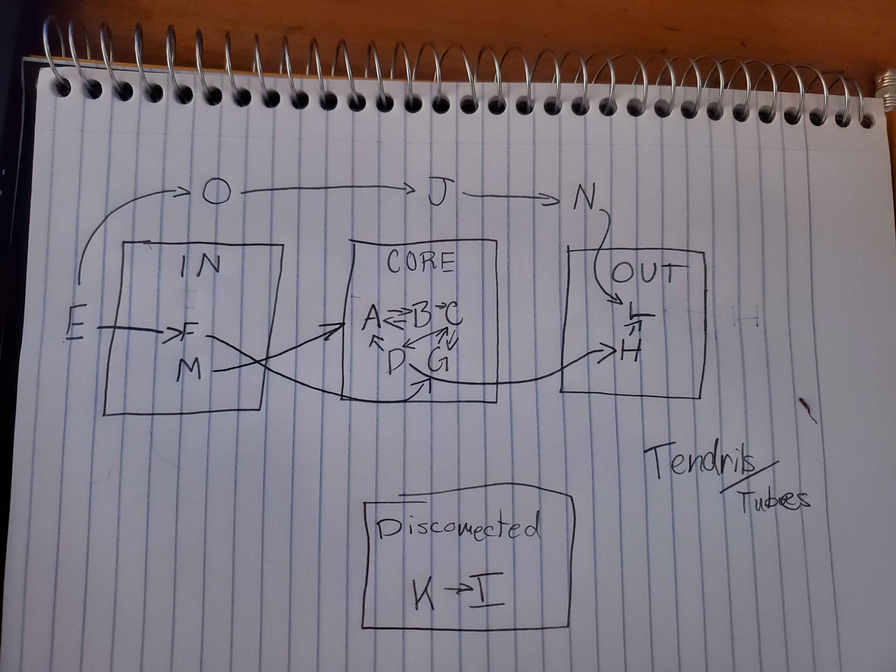
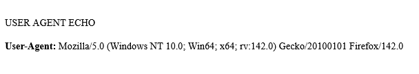
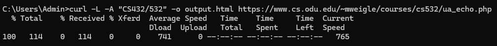
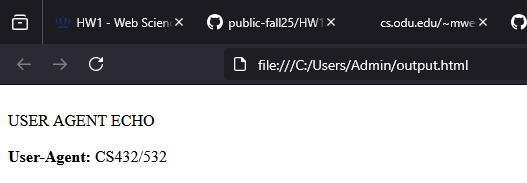

# HW1 - Web Science Intro
### Bryson Coons
### CS 432, Fall 2025
### September 14, 2025

# Q1
For this question, I began by analyzing which of the sites linked together within themselves to find the SCC sites. Then from there, I analyzed how the remaining sites linked related to the SCC. From there, I was able to begin constructing a directed graph, beginning with the SCC, and could move letters around as necessary. I was then able to determine which sites served as which "parts" of their ecosystem.

SCC - A B C D G
IN - F M
OUT - L H
Tendril - E (serves an IN tendril)
Tube - O J N (connects between IN and OUT)
Disconnected - K I (serves as its own little ecosystem)

The figure below shows my directed graph.

# Q2
PART A - I loaded the given URL in my browser:

PART B - I used a curl command using the following options:
-i to show response headers; 
-L to follow redirects; 
-A to set the User-Agent; 

PART C - I used a curl command using -L and -A again, but also a new option:
-o output.html to save the HTML content into a file, "output.html"; 
i didn't use -i here because i only wanted the HTML body.

PART D - After running the command, I just loaded the file it output in my browser.

# Q3

To complete this task, I wrote a Python script called collect-webpages.py that uses the requests and BeautifulSoup libraries. The goal was to start from a seed webpage, collect links, and filter them so that I only keep URIs that point to HTML pages larger than 1000 bytes.

* I used the requests library with a 5-second timeout to fetch pages. This prevents the program from hanging on dead sites.
* I parsed each page's HTML using the BeautifulSoup library, and converted relative to absolute links with urllib.parse.urljoin.
* I stored URI's in a set to make sure they're all unique. Many sites hold duplicate or repeated links, so this was important.
* Once a seed page is processed using these libraries, the program randomly selects one of the already-collected URI's as the next seed and crawls in a for loop. In this way, the program branches itself without user input.
* The only seed site I used was https://weiglemc.github.io/

The 500+ URI's collected can be found in collected_uris.txt

# References

* BeautifulSoup documentation, <https://www.crummy.com/software/BeautifulSoup/bs4/doc/>
* Python urllib.parse.urljoin documentation, <https://docs.python.org/3/library/urllib.parse.html#urllib.parse.urljoin>
* Real Python: Web Scraping with BeautifulSoup and Requests, <https://realpython.com/beautiful-soup-web-scraper-python/>
